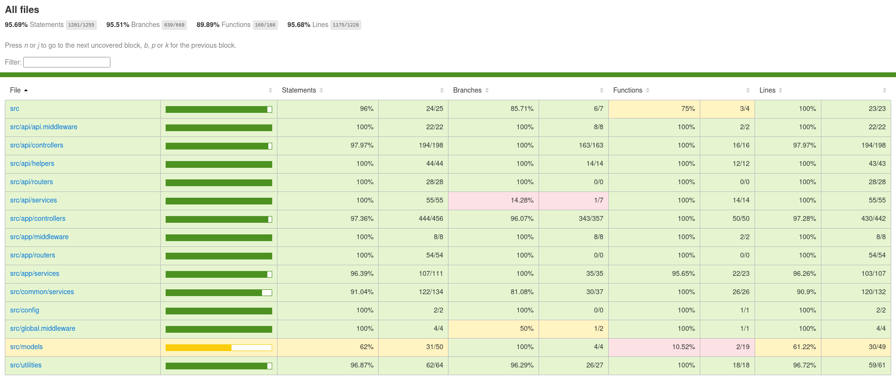

# Project Inventory Application
A project based primarily on a TypeScript, JavaScript, NodeJS, Express, and MongoDB app with EJS templating view engine and Mongoose ODM. It uses JEST for testing along with aws-sdk-client-mock for AWS mocking in tests.

# 1. Ecosystem Architecture

The goal is to create an app ecosystem for an organization selling computer hardware by actings as a full-fledged Inventory Management WebApp while also providing RESTful APIs for the [Shopping Cart App](https://2023-top-project-shopping-cart.pages.dev/).

### Ecosystem Applications
The ecosystem consists of two apps:
1. `Inventory App` :  Is an app that allows inventory mangement and order processing for the orders placed on the [Shopping Cart App](https://2023-top-project-shopping-cart.pages.dev/).
    
    - Provides RESTful APIs for the [Shopping Cart App](https://2023-top-project-shopping-cart.pages.dev/).
    - Provides a CMS for managing Products and Promos shown on the [Shopping Cart App](https://2023-top-project-shopping-cart.pages.dev/).

2. `Shopping App` : Is a React App that allows users to purchase products and subscribe to offers.
    - Uses RESTful Apis provided by the `Inventory App`.

### Ecosystem User Roles

The app ecosystem consists of two user roles:
- `Customers:` They use the [Shopping Cart App](https://2023-top-project-shopping-cart.pages.dev/) to place and managed orders.
- `Employees`: They use this `Inventory App` to perform inventory and logistics operations, including processing orders received through the `Shopping Cart App`.

# 2. Tech Stack

### Core Development Stack
The `Inventory App` part of the application (except the RESTful APIs provided for `Shopping Cart App`) makes use of the following technologies and packages:
- `NodeJS & Express` : NodeJS and Express are used to create the server and APIs.
- `EJS Template Engine` : EJS Template rendering engine is used for the front-end of the `Inventory App`.
- `MongoDB Atlas & Mongoose ORM` : MongoDB Atlas is the database of choice with Mongoose ORM being used for data modeling.
- `Connect Mongo & Express Session Based Login` : Employee authentication utilizes session-based login through `Express Session` and `Connect Mongo` packages.
- `JWT` : Used to authenticate api users, Customers of the [Shopping Cart App](https://2023-top-project-shopping-cart.pages.dev/).
- `Bcrypt Password Encryption` : Bcrypt is used for encrypting the passwords.
- `Express File Upload` : Media files are uploaded using the `Express File Upload` package.
- `Javascript & Typescript` : Typescript is used for type safety with it being converted to Javascript build.
- `Jest` : Jest is the framework used for testing.
- `AWS SDK Client Mock` : To mock AWS services for testing.

### AWS Development Services

The app is hosted on AWS EC2 and implements the following AWS cloud services:
- `SES V2` : For sending transactional emails to users.
- `Lamda` : For generating thumbnails of images uploaded in S3 Bucket.
- `SQS` : For decoupling the services receiving and handling the orders placed by customers on the Shopping Cart app.
- `S3 Buckets` : For storing files and images as objects.
- `SNS` : For sending subscription emails to customers of the Shopping Cart app.

### Deployment Stack
The `Inventory App` is deployed using the following technologies:
- `CI/CD Pipeline With GitHub` : A CI/CD pipeline is created by leveraging GitHub actions to automatically deploy newly implemented features to the production environment.
- `AWS EC2 Cloud Instance` : The application is deployed on the cloud on an AWS EC2 instance running Linux OS.
- `AWS CodeDeploy` : AWS CodeDeploy is used to automate the deployment process. It uses `AppSpec` and `Linux Shell Scripts` to deploy the `Inventory App` to the EC2 instance.
- `AWS Parameter Store` : `AWS Parameter Store` is used to manage environment variables and secrets.
- `Docker`: This Inventory App is deployed as a Docker container on the EC2 instance.
- `Nginx & Certbot`: Used to enable SSL certificates with auto renewal.

### Other AWS Services
In addition to the above, the app also uses the following AWS technologies:
- `VPC Gateway Endpoint - S3` - To enable access to S3 objects while disabling public access to the S3 bucket.
- `SSM Parameter Store`: For storing env variables.
- `CodeDeploy`: To deploy the app via a GitHub Actions CD pipeline to deploy the app.
- `STS`: To allow GitHub to assume a role that enables deployment to AWS without using access keys.
- `IAM`: To create a programmatic role with the required permissions for the application.

# 3. Description

Inventory App has two distinct functions:

1. Inventory Management: `Inventory App` is a full-fledged app that assists an organization in inventory management. The  employees can `Register` and `Login`, create `Categories` describing products, add `Products` to categories, and manage customer `Orders`. 

2. RESTful APIs: `Inventory App` provides RESTful APIs required by another app, `Shopping Cart App`, to function. The `Customers` of the business interact with  [Shopping Cart App](https://2023-top-project-shopping-cart.pages.dev/), to place and manage orders.     
The `Promos` shown in the `Carousel` of the `Shopping Cart App` are uploaded and managed in the `Inventory App`.   
Similarly, the `Orders` placed by the `Customers` in the `Shopping Cart App` are managed by the `Employees` in the `Inventory App`.

# 4. Objectives

## 4.1 Skill Demonstration Objectives
The application is created to demonstrate the following coding abilities:

    1. Build a full-stack app utilizing TypeScript, Node, Express, MongoDB Atlas / Mongoose, AWS cloud, and EJS templating engine.

    2. Creating RESTfuls APIs for connecting to a single-page web app.

    3. Utilizing a CI/CD pipeline for integration and deployment of new features automatically.

    4. Usage of Docker containerization to build and deploy the application and persist data using Docker volumes.

    5. Use of SSL certificates to provide an https server.

    6. Familiarity with the AWS cloud platform, with the project showing deployment to an EC2 instance using AWS CodeDeploy via AppSpec and Linux shell scripts, and storing environment variables in the AWS Parameter Store.

## 4.2 Functional Objectives
The webapp has the following functional objectives:

    1. Allows a computer hardware retailer to manage product inventory, promotions, and orders.

    2. Provide APIs to complement its customer-facing application, Shopping Cart.

Shopping Cart GitHub Repo [Click Here for Shopping Cart GitHub Repo Page](https://github.com/manvinderjit/2023-TOP-Project-Shopping-Cart).

Shopping Cart WebApp Live Link [Click Here for Shopping Cart WebApp Live Link](https://2023-top-project-shopping-cart.pages.dev/).

# 5. Inventory App: Usage Guide for Inventory Management Features

## 5.1 User Role: `Employee`
You will be using the inventory app as an `Employee` of the organization, i.e., your user role with be that of an `employee`.
## 5.2 User Actions: `Employee` 
As an `employee` user, you will be able to perform the following actions:

- Register as an `employee`.

- Log in as an `employee`.

- Perform CRUD operations related to a `Category` for products.

- Perform CRUD operations related to a `Product` in a category.

- Perform CRUD operations related to `Orders`.

- Perform CRUD operations related to `Promotions` that are shown in the `Carousel` or other areas of the customer-facing [Shopping Cart App](https://2023-top-project-shopping-cart.pages.dev/).

### 5.2.a. User Actions: Registering as an `Employee`

To register as an employee, click on the `Register` link in the top navigation bar.

Password must contain at least one number and one uppercase and lowercase letter, and at least 5 or more characters

    Using your actual email address is neither recommended nor required because no email registration link will be sent for account activation.

A success message will appear upon successful registration. In case of an error, take action according to the message.

    You can use these demo credentials to log in instead of registering your own account:
    email: `e@abc.com`
    password: `Admin1` 

### 5.2.b. User Actions: Log in as an employee 

To log in as an employee, use the credentials provided or the ones you used to register.

Upon successful login, you will be taken to the `Employee Dashboard`. It allows you to perform CRUD operations for the following:
- `Categories`: Categories are required for segmenting products. Each product must belong to a particular category, e.g., `Monitors`.
- `Products`: Products refer to any product to be sold by the organization. All products added through the `Inventory App` are then available for purchase via the `Shopping Cart App`.
- `Promos`: Any promos shown on the `Shopping Cart App`, like `Carousel Promos` are also added and managed through the `Inventory App`.
- `Orders`: Orders placed by `Customers` on the `Shopping Cart App` are managed by `Employees` through the `Inventory App`.

Click on the link according to the CRUD operation you want to perform.

### 5.2.c. User Actions: CRUD Operations - Category 

Clicking on the `Manage Categories` link will open the `Categories` page. It will show:
- An `Add a New Category` link to add a new category.
- All existing categories with the links to `View`, `Edit`, or `Delete` each of the categories.
#### Creating a Category 

1. To create a new `Category`, click on the `Add a New Category` link.
2. Add the `Category Name` and `Category Description`.
3. Click on the `Create Category` button.

If category was create successfully, a success alert will show. If something goes wrong, the corresponding error may appear. If you click `Back to All Categories` link at the bottom, it will take you to the `Categories` page. The new category should now be visible here.
#### Reading (Viewing) a Category 

1. To view a category, go to the `Category` page. 
2. Click on the corresponing `View` button for the category.
3. The page for that particular category will open and show the details.
4. Links to `Edit` and `Delete` that category are also available on the page.
#### Updating a Category 

1. Click on the `Edit` link for a `Category` from the `Categories` page or `View Category` page.
2. Change the `Category Name` and `Category Description`.
3. Click on the `Update Category` button to update the details for the category.
4. Upon successful updation, you will be taken to the `View` page for the updated category.
#### Deleting a Category 

1. Click on the `Delete` link for a `Category` from the `Categories` page or `View Category` page.
2. You will be taken to the `Delete Category` confirmation page. Click on the `Delete Category` button to delete the category.
3. After successful deletion, you will be taken back to the `Categories` page.

### 5.2.d. User Actions: CRUD Operations - Products 

Click on the `Manage Products` link from the employee `Dashboard`. It will open the `All Products` page. By default, it shows all `Products` with details in a list format. 

#### Viewing Products for Only a Particular Category

To view `Products` belonging to a specific category, select the category from the dropdown list and click on the `Get Products` button. It will show products only from the specified category.

#### Adding a New Product
1. To add a new product, click on the `Add a New Product` button. It will lead you to the `Create Product` page.
2. Enter all product details, select a category, and upload an image.
3. Click on the `Add Product` button. A success message will show if the product is created successfully.
4. Click on the `Back to All Products` link on the bottom to return to the `Products` page. The newly created product should be in the list.
5. This new product will also be added available on the [Shopping Cart App](https://2023-top-project-shopping-cart.pages.dev/). Click the link and visit the home page to confirm the same.

#### In addition to adding a product, the following product CRUD operations can be performed:
- `Viewing` a product's details on the `~/products/:productID` route.
- `Editing` a product's details on the `~/products/:productID/edit` route.
- `Changing` a product's image on the `~/products/:productID/edit/image` route.
- `Deleting` a product's image on the `~/products/:productID/delete` route.

### 5.2.e. User Actions: CRUD Operations - Promos 

This `Inventory App` allows `Employees` to manage the `Promos` visible in the carousel of the `Shopping App`. The following CRUD operations can be perfomed for the `Promos`.

#### Adding a Promo
1. To add a new Promo, go to the `Promos` page and click on the `Add a New Promo` page.
2. Enter all the promo details, select a promo category, upload a file, and select promo status.
3. Click on the `Add Promo` button. A success message will show if the promo is created successfully. In case of errors, take appropriate action.
4. Click on the `Back to All Promos` button to return to the `Promos` page. The newly created Promo should be in the list.
5. If you go to the home page of the [Shopping Cart App](https://2023-top-project-shopping-cart.pages.dev/) and the new Promo  should be listed.
#### Editing a Promo

### 5.2.f. User Actions: CRUD Operations - Orders 

This `Inventory App` allows `Employees` to manage the `Orders` placed by `Customers` on the `Shopping App`. They can change the `Orders Status` based on its fulfillment status(Processing, Ready for Shipping, Shipped, or Delivered).

#### Viewing Customer Orders
1. Click on the `Orders` link from the nav link to go to the `Manage Orders` page.
2. If required, filter the orders by selecting the Order Category from the dropdown list and click the `Get Orders` button to see the respective orders.
3. The page will show orders from the selected order category.

#### Updating Order Fullfilment Status
1. Click on the `Orders` link from the nav link to go to the `Manage Orders` page.
2. If required, filter the orders by selecting the Order Category from the dropdown list and click the `Get Orders` button to see the respective orders.
3. Click on the `Manage Order` button for that order for the order to be updated.
4. From the `Select New Order Status` dropdown list, select the new order status and click on the `Update Status` button.
5. The order status will be updated.

# 6. Inventory App: RESTful APIs
Inventory App also provides RESTful APIs for the customer-facing [Shopping Cart App](https://2023-top-project-shopping-cart.pages.dev/) used by the same organization. In addition to being a standalone WebApp, it acts as a back-end for the `Shopping Cart App`.

## 6.1 RESTful APIs Tech Stack and Packages
The inventory app uses additional technologies and packages for its RESTful APIs.

#### JWT Token
The APIs provided by the app use JWT-based authentication for protected API routes. These routes are for the [Shopping Inventory app](https://2023-top-project-shopping-cart.pages.dev/).

## 6.2 RESTful API Routes
The following routes are provided by the app:

### 6.2.a. RESTful API Routes: Public Routes
The application provides the following public routes:

`~/api/products` GET route to fetch data of all products sold by the organization.

`~/api/products/image/:productName` GET route to fetch product image by product name.

`~/api/products/image/thumbs/:productName` GET route to fetch product image thumbnail by product name.

`~/api/promos/carousel` GET route to fetch all active carousel promos.

`~/api/promos/image/:promoName` GET route to get a promo image by promo name.

`~/api/promos/image/thumbs/:promoName` GET route to get a promo image thumbnail by promo name.

`~/api/login` POST route to login users of the Shopping App.

`~/api/register` POST route to register uses of the Shopping App.

### 6.2.b. RESTful API Routes: Protected Routes
The application provides the following protected routes:

`~/api/orders`: GET request to fetch all orders for the logged-in user.

`~/api/orders/checkout`: POST request to checkout the cart items for the logged-in user.

`~/api/orders/cancel`: POST request to cancel an order based on the `order id` provided in the request body.

`~/api/subscribe`: GET request to fetch the subscription status for the logged-in user.

`~/api/subscribe`: POST request to allow the logged-in user to subscribe for offers.

`~/api/subscribe/cancel`: POST request to allow the logged-in user to cancel subscription.

# 7. Test Coverage

### Current Test Coverage Report:
The following is the current test coverage report screenshot for the main branch.

